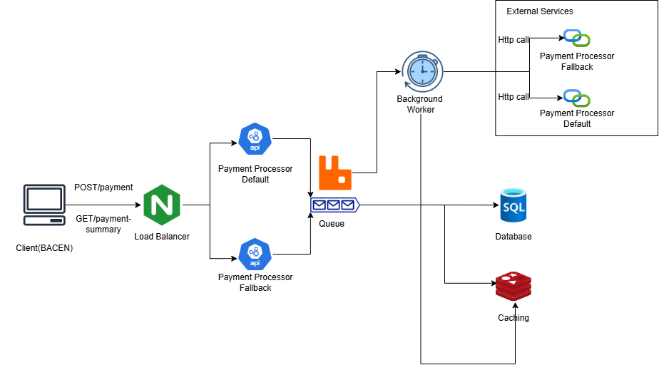

### Note!
This project is about a backend challenge, available in this repository: https://github.com/zanfranceschi/rinha-de-backend-2025. 

## **🛈 Index**
* 📋 [About](#about)
* ⚙️ [Api Architecture](#api-architecture)
    * 🗂️ [Project Structure](#structure)
* 🛠️ [System Design](#system-design)
* 🌐 [API Endpoints](#api-endpoints)
* 🌐 [Technical Specifications](#technical-specifications)

# About

This repository implements a Payment Processor with limited resources, handling a large number of requests even with limited infrastructure, focusing on creating a resilient + performatic backend.

## Project Details

This project uses the .NET AOT (Ahead Of Time) compilation, which is a technique used to compile code before runtime, resulting in 30% of performance improvement of the application runtime.

This project also uses ADO.NET , which is a set of classes that provide a way to interact with a database, avoiding the need to use ORMs to interact with the database, resulting in a better performance.

# Api Architecture
This API uses the Vertical Slice architecture to improve focus, scalability, and flexibility of the codebase.

## Structure

# System Design
A schema about how the system works. The resources limitations are in the docker-compose.yaml file.

# Technical Specifications
- .NET Core
- ADO.NET + AOT
- PostgreSQL
- Redis
- RabbitMQ
- Nginx
- Docker
- Docker Compose
